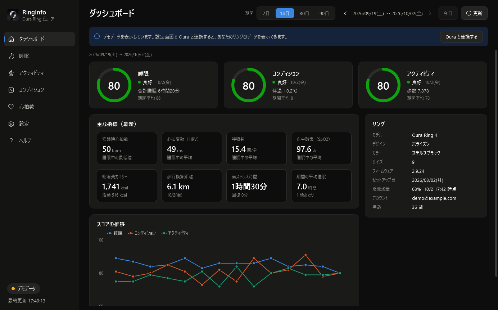
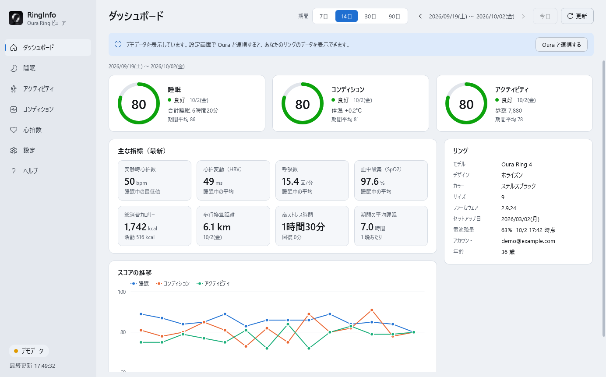
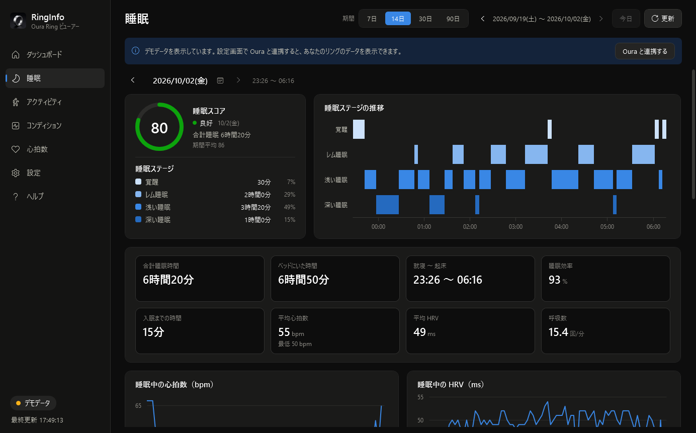
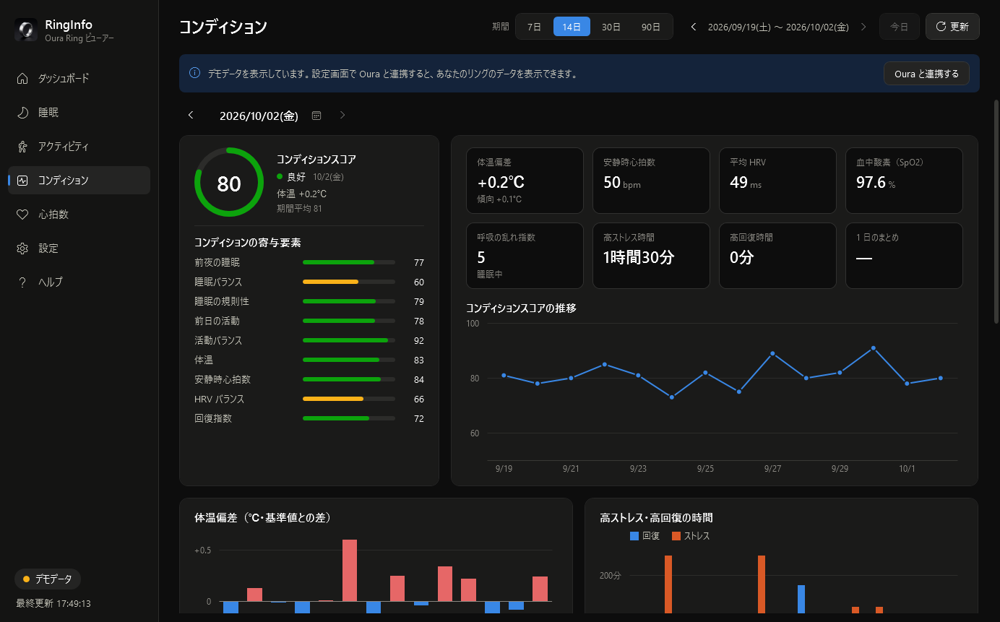
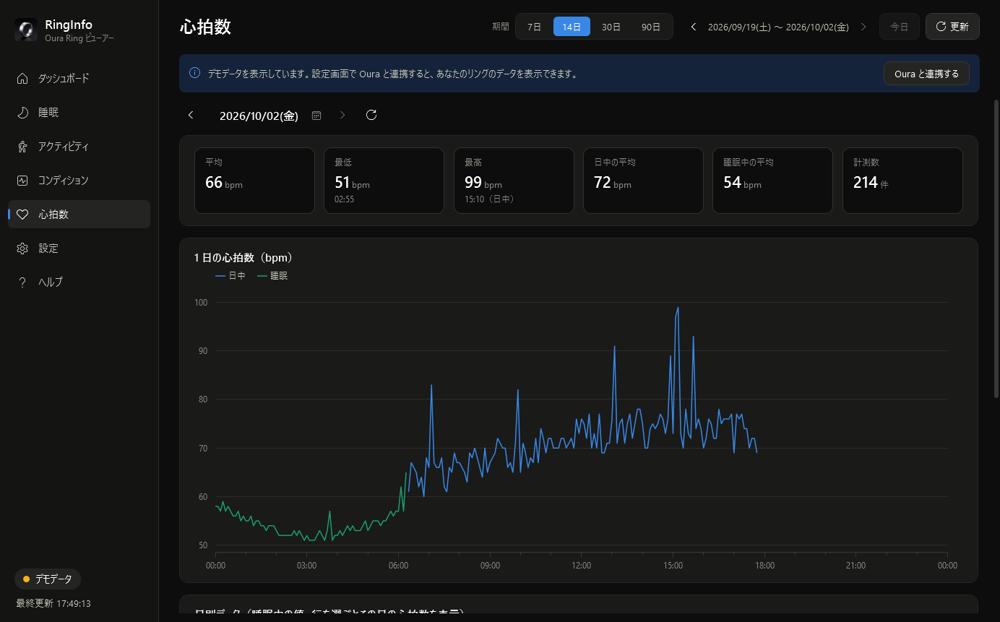
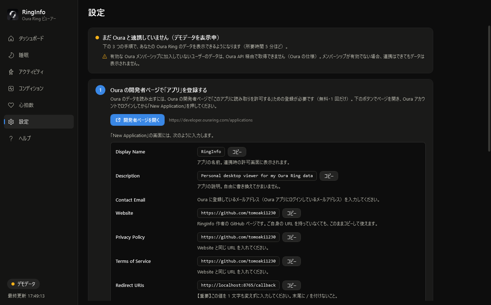

# RingInfo

Oura Ring のデータ（睡眠・アクティビティ・コンディション・心拍数）を Windows PC で見るためのデスクトップアプリです。
[Oura API v2](https://cloud.ouraring.com/v2/docs) から自分のデータを取得し、グラフと表で表示します。



## 主な機能

| ページ | 内容 |
| --- | --- |
| ダッシュボード | 睡眠・コンディション・アクティビティの最新スコア、主な指標（安静時心拍・HRV・SpO2 など）、スコアの推移、リング情報（モデル・電池残量など） |
| 睡眠 | 睡眠ステージの推移（ヒプノグラム）、睡眠中の心拍数・HRV、寄与要素、ステージ内訳の推移、日別の表 |
| アクティビティ | 歩数・活動カロリー・強度別の活動時間、寄与要素、ワークアウト、日別の表 |
| コンディション | Readiness スコア、体温偏差、安静時心拍数、HRV、血中酸素、ストレス・回復時間、日別の表 |
| 心拍数 | 1 日の心拍数（日中・睡眠・ワークアウト別）、日別の表 |
| 設定 | Oura との OAuth2 連携・連携解除、画面のテーマ |
| ヘルプ | バージョン・製作者・著作権・使い方・商標 |

- 表示期間は 7 / 14 / 30 / 90 日から選択し、前後の期間にも移動できます。
- 表の行をクリックすると、その日の詳細に切り替わります。
- Oura と連携していない状態では **デモデータ** で全画面を確認できます。
- 日付を押すとカレンダーが開き、取得期間内の日を選べます。
- 画面のテーマは「設定」で「システムに合わせる（既定）／ライト／ダーク」から選べます。



| 睡眠 | コンディション |
| --- | --- |
|  |  |
| **心拍数** | **設定** |
|  |  |

## 動作環境

- Windows 10 / 11（x64）
- [.NET 8 Desktop Runtime](https://dotnet.microsoft.com/download/dotnet/8.0)（ランタイム同梱版を使う場合は不要）
- Oura Ring と Oura アカウント
- **有効な Oura メンバーシップへの加入**（加入していないユーザーのデータは、Oura API 経由で取得できません。Oura の仕様です）

## Oura との連携方法

Oura API はアプリごとの登録（OAuth2）が必要です（個人用アクセストークンは 2025 年 12 月に廃止）。
利用者が各自で Oura の開発者ページにアプリを登録し、その情報を RingInfo に入力します。
アプリの「設定」ページに手順と、各項目に入れる値の一覧（コピーボタン付き）が表示されるので、それに沿って進めてください。

1. [Oura の開発者ページ](https://developer.ouraring.com/applications) にログインし、「New Application」を作成します。
   - Display Name: `RingInfo`
   - Contact Email: Oura に登録しているメールアドレス
   - Website / Privacy Policy / Terms of Service: `https://github.com/tomoaki1230`（RingInfo 作者の GitHub。ご自身の URL が無くてもこのまま使えます）
   - Redirect URIs: `http://localhost:8765/callback`（1 文字も変えずに入力）
   - Scopes: すべてチェック、API Agreement に同意して作成
2. 作成したアプリの Client ID と Client Secret を、RingInfo の「設定」に貼り付けます。
3. 「Oura と連携する」を押し、ブラウザで Oura にログインしてアクセスを許可します。

アクセストークンは期限が近づくと自動で更新されます。ポート 8765 が使えない場合は、詳細設定でリダイレクト URI のポート番号を変更し、Oura 側の登録も同じ値に変更してください。

## データの保存先とプライバシー

- 設定は `%APPDATA%\RingInfo\settings.json` に保存されます。
- Client Secret とトークンは Windows の DPAPI（現在のユーザーのみ復号可能）で暗号化して保存します。
- 取得したデータは画面表示にのみ使い、ファイルや外部サービスには送信・保存しません。通信先は Oura（`api.ouraring.com` / `cloud.ouraring.com`）のみです。

## ビルドと実行

.NET 8 SDK が必要です。

```powershell
dotnet build RingInfo.sln
dotnet test RingInfo.sln
dotnet run --project src/RingInfo.App
```

### 配布用 exe の作成

```powershell
dotnet publish src/RingInfo.App/RingInfo.App.csproj -c Release -o dist
```

`dist/RingInfo.exe`（単一ファイル、約 2 MB）が生成されます。実行には [.NET 8 Desktop Runtime](https://dotnet.microsoft.com/download/dotnet/8.0) が必要です。

#### ランタイム同梱版（.NET のインストール不要）

```powershell
dotnet publish src/RingInfo.App/RingInfo.App.csproj -c Release -p:PublishProfile=SelfContained
```

`dist/self-contained/RingInfo.exe`（単一ファイル、約 68 MB）が生成されます。.NET が入っていない Windows 10 / 11（x64）でもそのまま動きます。
起動時に exe 内のファイルを展開するため、通常版より起動がやや遅くなります。

## フォルダー構成

```
RingInfo.sln
src/
  RingInfo.Core/        Oura API クライアント・OAuth2・設定保存・デモデータ・集計（net8.0）
  RingInfo.App/         WPF アプリ本体（net8.0-windows、MVVM）
tests/
  RingInfo.Core.Tests/  Core の単体テスト（xUnit）
  RingInfo.App.Tests/   ViewModel とグラフ生成のテスト（xUnit）
tools/make_icon.py      アプリアイコンの生成スクリプト（元画像: tools/icon-source.png）
docs/screenshots/       README 用の画像
```

## ライセンス

[MIT License](LICENSE)  
使用しているライブラリのライセンスは [THIRD-PARTY-NOTICES.md](THIRD-PARTY-NOTICES.md) を参照してください。

## 製作者

Tomoaki Bessho（[GitHub](https://github.com/tomoaki1230)）  
Copyright (c) 2026 Tomoaki Bessho

## 使用ライブラリ

ライセンスの全文は [THIRD-PARTY-NOTICES.md](THIRD-PARTY-NOTICES.md) にあります（アプリの「ヘルプ」からも表示できます）。

- [CommunityToolkit.Mvvm](https://github.com/CommunityToolkit/dotnet)（MIT）
- [OxyPlot](https://github.com/oxyplot/oxyplot)（MIT）
- [System.Security.Cryptography.ProtectedData](https://www.nuget.org/packages/System.Security.Cryptography.ProtectedData)（MIT）

## 注意事項

- 本アプリは Oura 公式のアプリではありません。Oura製品に関する「OURA」「OURARING」などの名称やロゴは、開発元である Oura Health Oy の登録商標です。
- 表示内容は医療目的の診断に使用しないでください。
